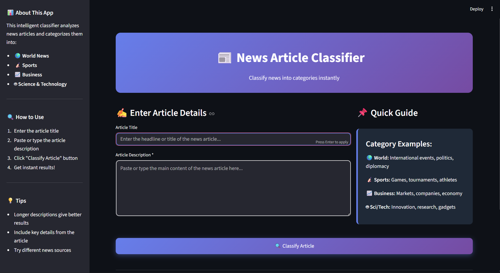

# 📰 News Article Classification Using Machine Learning

A Machine Learning project that classifies news articles into categories using NLP.

## 🔍 Project Overview
This project uses Natural Language Processing (NLP) to classify news articles into different categories using machine learning.

## 📌 Features
- Text preprocessing
- TF-IDF Vectorization
- Machine Learning model
- Streamlit web interface
- 
## 📷 Application Screenshots

## 🛠 Tech Stack
- Python
- Scikit-learn
- Streamlit
- Pandas & NumPy

## 📦 How to Run

1. Clone the repo
git clone https://github.com/Ebin017/news-article-classifier

2. Install requirements
pip install -r requirements.txt

3. Run the app
streamlit run news.py

## 🙌 Author
Ebin Raj
